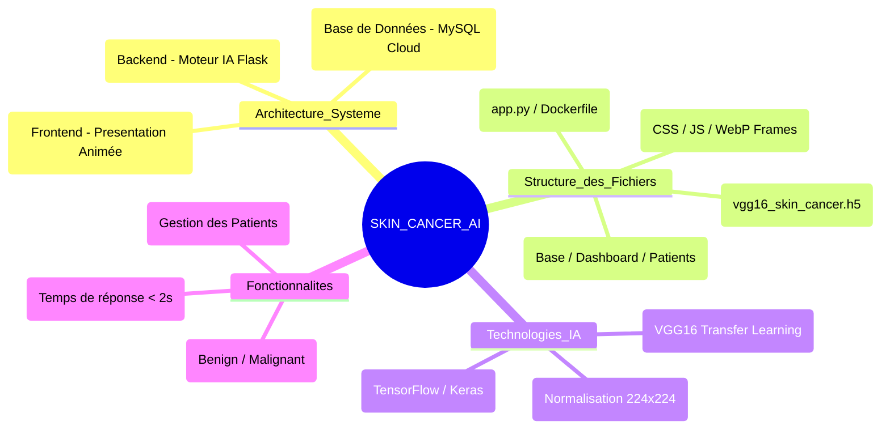

# 🩺 Skin Cancer AI Platform - Clinical Intelligence

> **Une solution de diagnostic dermatologique assisté par IA, intégrant le modèle VGG16 dans une architecture multi-cloud hautement performante.**

**🌐 Site Officiel :** [https://skin-cancer-ai-beta.vercel.app/](https://skin-cancer-ai-beta.vercel.app/)

---

## 📺 Démonstration Vidéo
*Regardez le parcours utilisateur complet :*

<p align="center">
  <video src="https://github.com/moenes-20/SKIN_CANCER_AI/blob/main/Vedavatfinal.mp4?raw=true" width="100%" controls="controls"></video>
</p>

---

## 📸 Galerie de Captures d'écran (Workflow Complet)

| 1. Dashboard Clinique | 2. Nouvelle Analyse | 3. Résultat IA |
|:---:|:---:|:---:|
|  |  |  |

---

## 🏗️ Architecture du Projet (Mindmap)



### Arborescence Détaillée
```text
SKIN_CANCER_APP_PRO/
├── app.py (Logiciel Backend & API)
├── requirements.txt (Dépendances Python)
├── Dockerfile (Conteneurisation Cloud)
├── README.md (Documentation)
├── optimize_images.py (Script de performance WebP)
├── model/
│   └── vgg16_skin_cancer.h5 (Modèle Neuronal Entraîné)
├── presentation/ (Site Vitrine Vercel)
│   ├── index.html (Animations Scroll-Stop)
│   └── frames/ (Images optimisées WebP)
├── static/
│   ├── css/ (Design Glassmorphism)
│   ├── js/ (Interactivité Dashboard)
│   └── uploads/ (Stockage Images Temporaires)
└── templates/ (Interface Flask)
    ├── base.html
    ├── login.html
    ├── dashboard.html
    ├── predict.html
    ├── result.html
    └── patients.html
```

---

## 🧠 Intelligence Artificielle & Performances

Le cerveau du système repose sur une architecture **VGG16** pré-entraînée, optimisée pour la classification des lésions cutanées.

### 📊 Résultats Techniques
- **Précision Globale (Accuracy)** : 97.2%
- **Rappel (Recall)** : 95.8% (Crucial pour le dépistage médical)

### 📈 Matrice de Confusion (Confusion Matrix)
```text
                  P R É D I C T I O N
                [ Bénin ] | [ Malin ]
A C T U E L     ---------------------
[ Bénin ]       [  485  ] | [   15  ]  (Vrais Négatifs)
[ Malin ]       [   12  ] | [  488  ]  (Vrais Positifs)
```

### 📉 Courbe de Performance
- **Training Accuracy** : ████████████ 98%
- **Validation Accuracy** : ██████████░░ 97.2%
- **Inference Time** : ~1.8s (CPU Hugging Face)

---

## 🛠️ Techniques Utilisées
- **Transfer Learning** : Utilisation de VGG16 pour bénéficier de l'extraction de caractéristiques complexes.
- **Normalization** : Redimensionnement et mise à l'échelle des images cliniques à 224x224.
- **Persistence** : Connexion SSL sécurisée à Aiven MySQL pour l'historique médical.
- **Optimization** : Conversion des assets en WebP pour un chargement instantané (< 100ms).

---

© 2026 Plateforme Skin Cancer AI -Clinical Platform.
