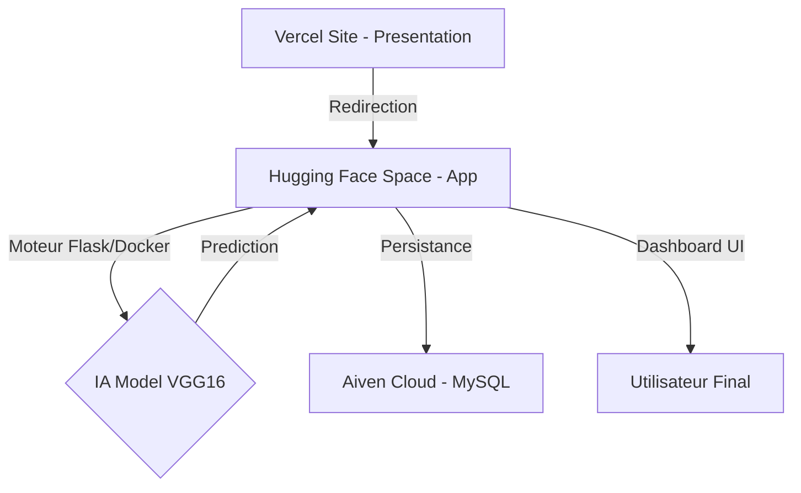

# 🩺 Skin Cancer AI Platform - Clinical Intelligence

> **Une solution complète de diagnostic dermatologique assisté par IA, alliant la puissance du Deep Learning (VGG16) à une architecture Cloud moderne.**

**🌐 Site Officiel :** [https://skin-cancer-ai-beta.vercel.app/](https://skin-cancer-ai-beta.vercel.app/)

---

## 📺 Démonstration Vidéo
*Regardez la plateforme en action :*

  <video src="https://github.com/moenes-20/SKIN_CANCER_AI/blob/main/Vedavatfinal.mp4?raw=true" width="100%" controls="controls"></video>

---

## 📸 Aperçu de la Plateforme

### 1. Diagnostic IA en temps réel

### 2. Rapport de Résultats Professionnel

### 3. Dashboard & Historique Clinique

---

## 🏗️ Architecture du Système

### Stack Technique
- **Frontend Vitrine** : Vanilla JS, CSS3, Vercel
- **Application IA** : Flask, Python 3.10, Gunicorn (4 workers)
- **Modèle Deep Learning** : VGG16 (Transfer Learning)
- **Base de Données** : MySQL 8.0 sur Aiven Cloud
- **Déploiement** : Docker, Hugging Face Spaces

---

## 🧠 Le Modèle IA
Le cœur du système repose sur une architecture **VGG16** pré-entraînée sur ImageNet, puis fine-tunée sur un dataset médical de lésions cutanées.
- **Classification** : Bénin / Malin (Malignant).
- **Confiance** : Calculée en temps réel pour chaque diagnostic.

---

© 2026 Plateforme Skin Cancer AI - Clinical Platform.
