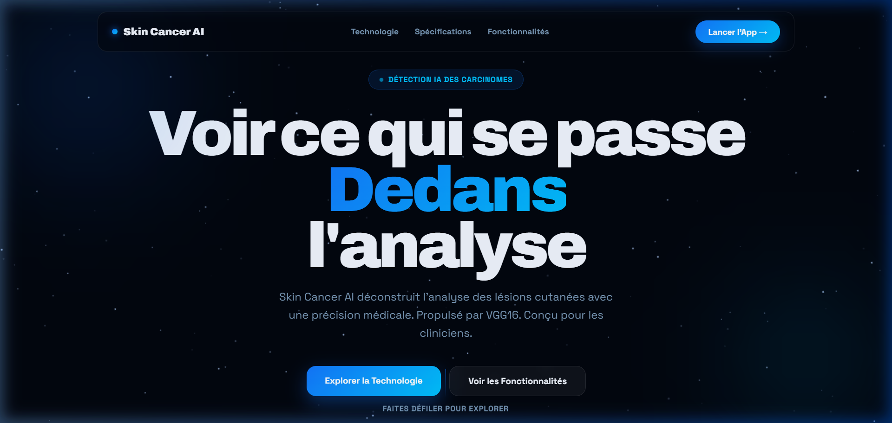
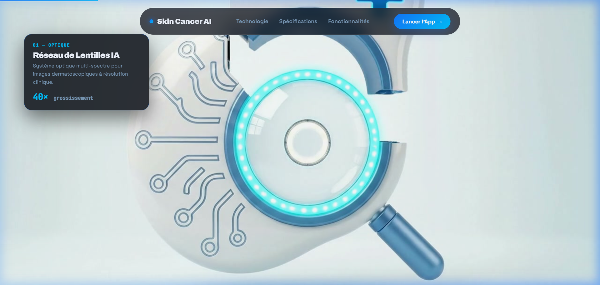
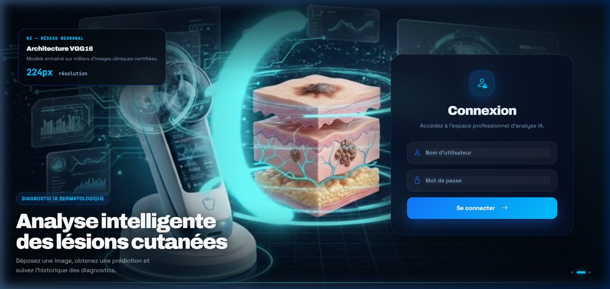
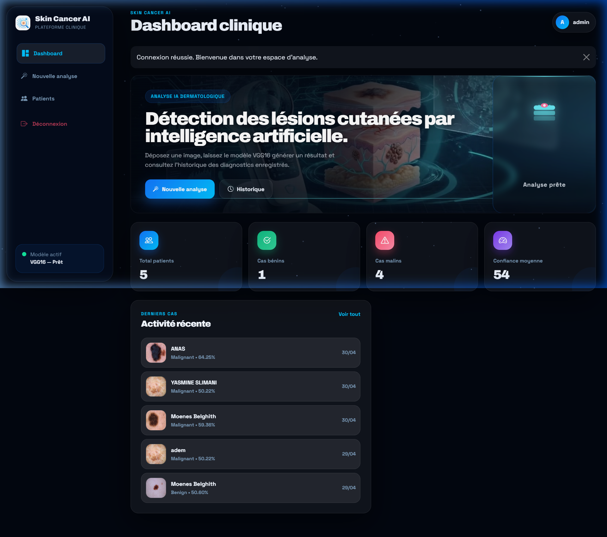
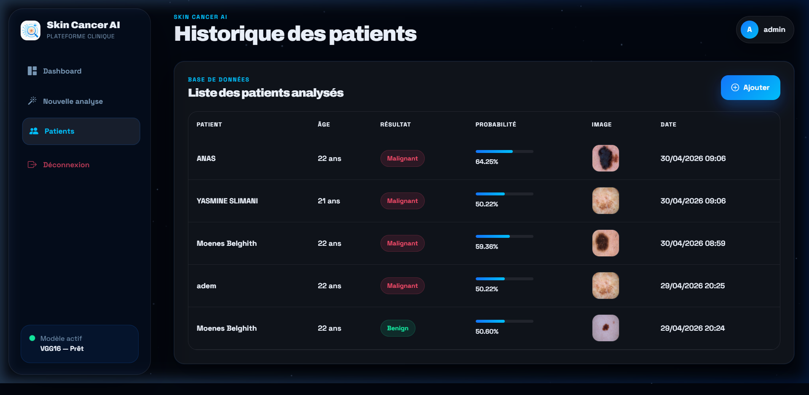
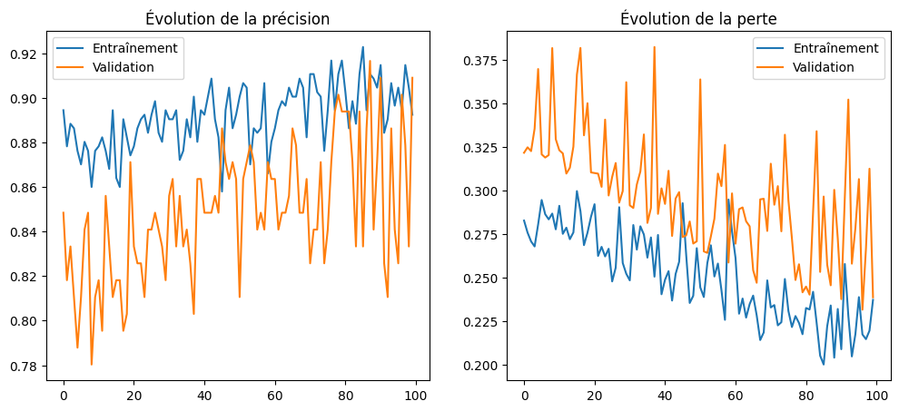
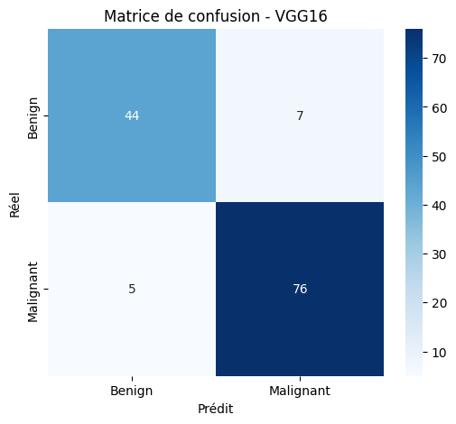
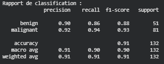

<div align="center">

# 🩺 Skin Cancer AI

### Plateforme de détection intelligente des lésions cutanées par Deep Learning

[](https://python.org)
[](https://flask.palletsprojects.com)
[](https://tensorflow.org)
[](https://mysql.com)

---

🔗 **[Accéder au Modèle (Google Drive)](https://drive.google.com/file/d/12XF6OPGURb9wIqkE9kgjsDeZzj8MDbwx/view?usp=sharing)** &nbsp;|&nbsp; 📸 **[Captures d'écran](#screenshots)** &nbsp;|&nbsp; 📊 **[Résultats d'Entraînement](#training)** &nbsp;|&nbsp; 🌐 **[Lancer le Site Web (Vercel)](https://skin-cancer-ai-beta.vercel.app/)**

</div>

---

## 📺 Démonstration Vidéo
*Regardez comment utiliser la plateforme en temps réel :*

<p align="center">
  <video src="https://github.com/moenes-20/SKIN_CANCER_AI/blob/main/Vedavatfinal.mp4?raw=true" width="100%" controls="controls"></video>
</p>

---

## 📋 Description du Projet

**Skin Cancer AI** est une solution complète de diagnostic assisté par ordinateur. Elle intègre un modèle de Deep Learning de pointe (**VGG16**) dans une interface utilisateur moderne et fluide. Le système permet aux cliniciens d'analyser des images dermatoscopiques pour classer les lésions en deux catégories : **Bénin** ou **Malin**.

L'interface utilise des techniques avancées de rendu (**Canvas API**) pour des animations fluides et un design **Glassmorphism** premium, offrant une expérience utilisateur digne des standards de l'industrie.

---

<a name="screenshots"></a>
## 🖼️ Captures d'écran

### 1. Site de Présentation Immersion

*Landing page interactive avec effets de particules et design épuré.*

### 2. Animation Scroll-Stop

*Déconstruction technique de l'analyse IA avec annotations dynamiques.*

### 3. Authentification Cinématique

*Animation plein écran pilotée par canvas pour une fluidité maximale.*

### 4. Dashboard de Pilotage

*Vue d'ensemble des statistiques et accès rapide aux outils d'analyse.*

### 5. Analyse Intelligente

*Module d'upload et de prédiction instantanée.*

### 6. Résultat de Diagnostic

*Rapport détaillé généré par l'IA avec score de confiance.*

### 7. Suivi des Patients

*Historique complet des diagnostics enregistrés en base de données.*

---

<a name="training"></a>
## 🧠 Le Modèle & Résultats

### Architecture VGG16
Le modèle est basé sur l'architecture **VGG16**, optimisée par Transfer Learning. Il analyse les caractéristiques morphologiques des lésions pour fournir un diagnostic de précision.

### 📊 Performances Réelles
Voici les résultats obtenus après l'entraînement du modèle :


*Évolution de la précision et de la perte sur 100 époques.*


*Matrice de confusion montrant la précision par classe (Bénin vs Malin).*


*Rapport détaillé des métriques (Précision, Rappel, F1-Score).*

### 📦 Téléchargement du Modèle
Le modèle entraîné (`.h5`) est disponible sur Google Drive (~500 Mo) :
👉 **[Télécharger vgg16_skin_cancer.h5](https://drive.google.com/file/d/12XF6OPGURb9wIqkE9kgjsDeZzj8MDbwx/view?usp=sharing)**

---

## 🏗️ Architecture du Projet

```mermaid
graph TD
    Root["📁 SKIN_CANCER_AI"]
    
    Root --> AppPy["📄 app.py"]
    Root --> DBSql["📄 database.sql"]
    Root --> Req["📄 requirements.txt"]
    Root --> Run["📄 LANCER_SKIN_CANCER_AI.bat"]
    
    Root --> Model["📁 model/"]
    Model --> VGG["📄 vgg16_skin_cancer.h5"]
    
    Root --> Pres["📁 presentation/"]
    Pres --> PIdx["📄 index.html"]
    Pres --> PFrames["📁 frames/"]
    
    Root --> Res["📁 resultat/"]
    Res --> RGraph["📊 Graphes & Metrics"]
    
    Root --> Static["📁 static/"]
    Static --> CSS["📁 css/style.css"]
    Static --> JS["📁 js/app.js"]
    Static --> Uploads["📁 uploads/"]
    
    Root --> Temp["📁 templates/"]
    Temp --> TBase["📄 base.html"]
    Temp --> TLogin["📄 login.html"]
    Temp --> TDash["📄 dashboard.html"]
    Temp --> TResult["📄 result.html"]
    
    style Root fill:#0a1628,stroke:#1378ff,stroke-width:2px,color:#fff
    style Pres fill:#1a0a28,stroke:#a78bfa,color:#fff
    style Res fill:#0a2800,stroke:#00c2ff,color:#fff
```



---

## 🛠️ Outils & Technologies

- **Backend** : Flask (Python)
- **ML/IA** : TensorFlow, Keras (VGG16)
- **Data** : NumPy, Pillow (Image Processing)
- **Database** : MySQL
- **Frontend** : Vanilla JS (Canvas API), CSS Glassmorphism, Bootstrap Icons
- **Deployment** : Hugging Face (Backend), Vercel (Frontend)

---

## 🚀 Installation Locale

Suivez ces étapes pour lancer **Skin Cancer AI** sur votre machine :

### 1. Préparation de l'environnement
```bash
# Cloner le projet
git clone https://github.com/moenes-20/SKIN_CANCER_AI.git
cd SKIN_CANCER_AI

# Créer un environnement virtuel
python -m venv .venv
.venv\Scripts\activate  # Windows
```

### 2. Installation des dépendances
```bash
pip install -r requirements.txt
```

### 3. Configuration Base de Données (MySQL)
Configurez votre serveur MySQL local et importez le schéma :
```sql
CREATE DATABASE skin_cancer_db;
-- Importez le fichier database.sql
```

### 4. Installation du Modèle
Téléchargez le modèle depuis le lien Drive ci-dessus et placez-le dans le dossier `model/` :
`model/vgg16_skin_cancer.h5`

### 5. Lancement
```bash
# Double-cliquez sur :
LANCER_SKIN_CANCER_AI.bat
```
Accédez au site de présentation via : `http://localhost:8080`

---

<div align="center">

**Skin Cancer AI · Diagnostic de Précision · 2026**

</div>
