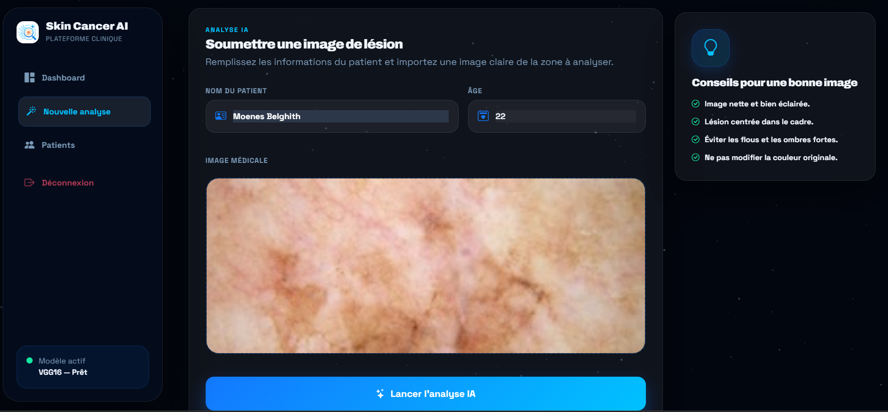
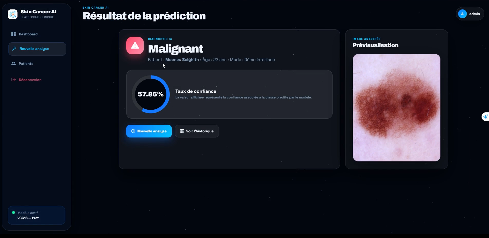

# 🩺 Skin Cancer AI Platform

> **Plateforme professionnelle de détection des lésions cutanées par intelligence artificielle.**

---

## 📺 Démonstration Vidéo
Découvrez comment utiliser la plateforme en quelques secondes :

https://github.com/moenes-20/SKIN_CANCER_AI/blob/main/Vedavatfinal.mp4?raw=true

<video src="Vedavatfinal.mp4" width="100%" controls></video>

---

## 📸 Aperçu de l'interface

### 1. Analyse en cours
L'utilisateur dépose une image de lésion pour obtenir un diagnostic instantané.

### 2. Résultat de l'IA
Le modèle VGG16 génère un rapport détaillé avec le score de confiance.

---

## 🛠️ Architecture du projet

- **Frontend** : [Vercel](https://skin-cancer-ai-beta.vercel.app/) (Interface utilisateur moderne & interactive)
- **Backend & AI** : [Hugging Face Spaces](https://huggingface.co/spaces/moenes123/skin-cancer-ai-v2) (Moteur Python / Flask / Docker)
- **Base de Données** : [Aiven Cloud MySQL](https://aiven.io/) (Persistance sécurisée des données patients)
- **Modèle IA** : VGG16 Fine-tuned (Diagnostic dermatologique)

---

## 🚀 Déploiement

- **Plateforme Présentation** : Vercel
- **Serveur d'Analyse (Backend)** : Hugging Face
- **Stockage Données** : Aiven Cloud MySQL

---

© 2026 Skin Cancer AI Project - Clinical Platform.
