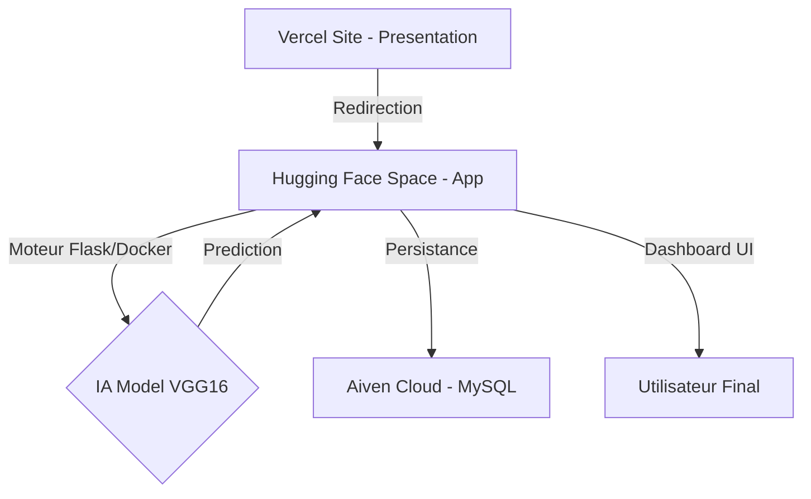

# 🩺 Skin Cancer AI Platform - Clinical Intelligence

> **Une solution complète de diagnostic dermatologique assisté par IA, alliant la puissance du Deep Learning (VGG16) à une architecture Cloud moderne.**

---

## 📺 Démonstration Vidéo
Découvrez le parcours utilisateur complet, de la présentation à l'analyse clinique :

  <video src="Vedavatfinal.mp4" width="100%" controls></video>

---

## 📸 Aperçu de la Plateforme

### 1. Site de Présentation (Vercel)
Une interface immersive avec animations "scroll-stop" pour présenter le projet.

### 2. Dashboard Clinique (Hugging Face)
Le centre de contrôle pour la gestion des patients et des analyses.

### 3. Processus d'Analyse IA
L'utilisateur dépose une image pour une prédiction instantanée.

### 4. Rapport de Diagnostic
Résultats détaillés générés par le modèle VGG16 fine-tuné.

---

## 🏗️ Architecture du Système

### Stack Technique
- **Frontend Vitrine** : Vanilla JS, CSS3, Vercel
- **Application IA** : Flask, Python 3.10, Gunicorn (4 workers)
- **Modèle Deep Learning** : VGG16 (Transfer Learning)
- **Base de Données** : MySQL 8.0 sur Aiven Cloud
- **Déploiement** : Docker, Hugging Face Spaces

---

## 🧠 Le Modèle IA
Le cœur du système repose sur une architecture **VGG16** pré-entraînée sur ImageNet, puis fine-tunée sur un dataset médical de lésions cutanées.
- **Entrée** : Images 224x224 pixels.
- **Sortie** : Classification Binaire (Bénin / Malin) avec score de confiance.
- **Performance** : Optimisé pour la détection clinique assistée.

---

## 🚀 Installation & Déploiement

### Déploiement Cloud
- **Frontend** : Connecter le dossier `/presentation` à Vercel.
- **Backend** : Utiliser le script `upload_to_hf.py` pour envoyer le projet sur Hugging Face.

### Lancement Local
Exécuter le fichier `LANCER_SKIN_CANCER_AI.bat` pour démarrer le serveur Flask localement sur le port 5000.

---

© 2026 Plateforme Skin Cancer AI - Développé pour l'excellence médicale.
